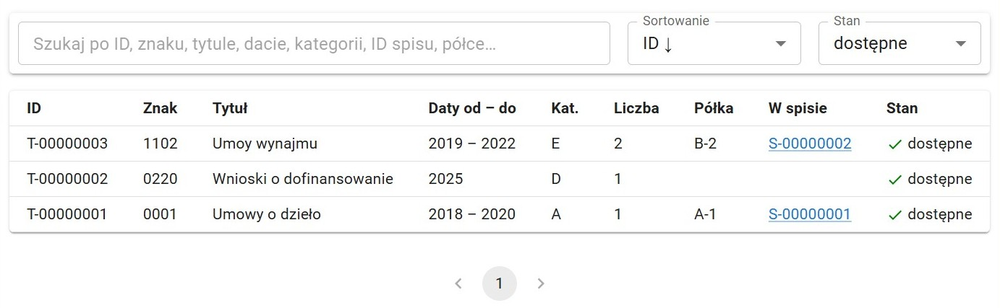
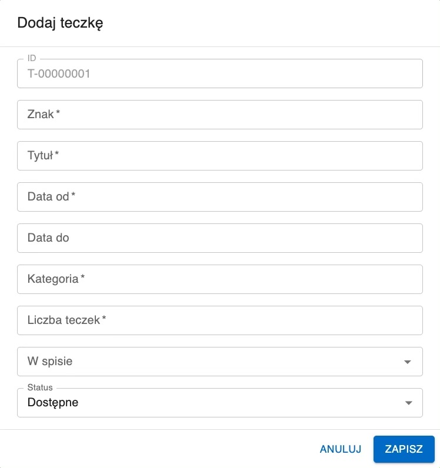

#  Teczki

Moduł Teczki przedstawia oraz umożliwia edycję zbioru teczek wprowadzonych do systemu.

## Przeszukiwanie listy teczek

Pasek wyszukiwania daje możliwość filtrowania listy teczek. W wyszukiwarce można wpisać dowolny ze szczegółów teczki, np. jej półkę, spis lub tytuł.

Listę można sortować według wielu kryteriów. Aby to zrobić należy kliknąć w Sortowanie na pasku wyszukiwania (domyślne sortowanie: ID malejąco).

Pole Stan pozwala wybrać teczki z jakim statusem mają być wyświtlane. Opcjami do wyboru są:

- Dostępne - wszystkie teczki znajdujące się w archiwum (domyślne)
- Zniszczone - wszystie teczki, które zostały zniszczone
- Wszystkie - zarówno dostępne jak i zniszczone teczki

Aby podjąć operację z elementem listy należy go wybrać. Aby to zrobić należy kliknąć w niego na liście.

Aby usunąć zaznaczenie z elementu listy należy wybrać z paska narzędzi przycisk Odznacz. Taki sam efekt daje kliknięcie w puste miejsce poza tabelą.

Przeglądanie następnych stron listy umożliwiają strzałki pod tabelą.

## Dodawanie teczki

Wybranie przycisku Dodaj z paska narzędzi spowoduje otwarcie okna dodawania nowej teczki. Okno to zawiera pola:

- **ID** - liczba porządkowa teczki automatycznie generowana przez system
- **Znak** - znak teczki
- **Tytuł** - tytuł teczki
- **Data od** - data początkowa teczki
- **Data od** - data końcowa teczki _(opcjonalne)_
- **Kategoria** - kategoria teczki
- **Liczba teczek** - liczba fizycznych teczek
- **W spisie** - przypisanie teczki do istniejącego już w systemie spisu _(opcjonalne)_
- **Status** - Dostępne/Zniszczone, domyślnie Dostępne

## Niszczenie a usuwanie teczki

Jeśli teczka jest fizycznie niszczona należy wybrać teczkę z listy a następnie wybrać z paska narzędzi przycisk Zniszcz, zmienia to jej status na _Zniszczone_. Teczka taka znika z domyślnego widoku listy teczek (aby ją wyświetlić należy zmienić sortowanie listy - więcej o tym w dziale [Przeszukiwanie listy teczek](#przeszukiwanie-listy-teczek)).

Przycisku Usuń należy używać tylko i wyłącznie wtedy, gdy wybrana pozycja nie powinna nigdy się znajdować w systemie.

Użycie funkcji Usuń powoduje permamentne usunięcie elementu, podczas gdy Zniszcz zachowuje go w systemie, jedynie zmieniając jego status na _Znieszczone_.

## Edycja szczegółów teczki

Po wybraniu teczki do edycji należy wybrać z paska narzędzi Edytuj. Spowoduje to otworzenie formularza identycznego do formularza dodawania.
