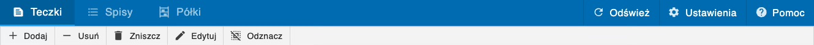

# Interfejs

<!-- Aplikacja Archivio składa się z [Paska menu](#pasek-menu)(1) test^(2)^ -->

Aplikacja Archivio składa się z [paska menu](#pasek-menu) z [widokami](#widoki), opcjami i narzędziami oraz głównego obszaru roboczego wybranego widoku.

## Pasek menu

Na górnej belce paska menu po lewej stronie znajdują się zakładki do przełączania widoków ([Teczki](folders.html)/[Spisy](sets.html)/[Półki](shelves.html)), a po prawej [Odśwież](#odswiez), [Ustawienia](#ustawienia) oraz [Pomoc](#pomoc).

Dolna belka zawiera narzedzia do zarządzania elementami tabeli.

### Odśwież

Gdy aplikacja będzie długo w stanie "bez odpowiedzi" należy odświeżyć aplikację tym przyciskiem z [paska menu](#pasek-menu). Jeśli to nie pomoże, należy ponownie uruchomić aplikację.

### Ustawienia

Przycisk ustawienia otwiera menu ustawień. Ustawienia zostały opisane w dziale pomocy [Ustawienia](settings.html).

### Pomoc

Przycisk pomoc otwiera to okno pomocy.

## Widoki

Obsługa modułów aplikacji w dancyh widokach jest opisana w odpowiadających im działach pomocy:

- [ Teczki](folders.html)

- [ Spisy](sets.html)

- [ Półki](shelves.html)
