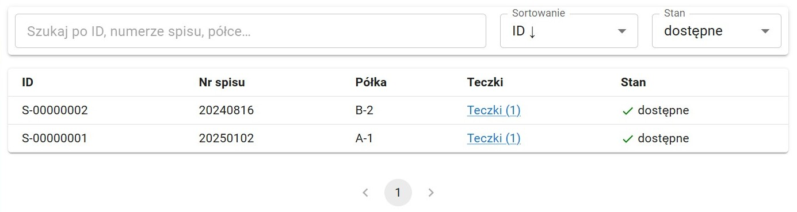
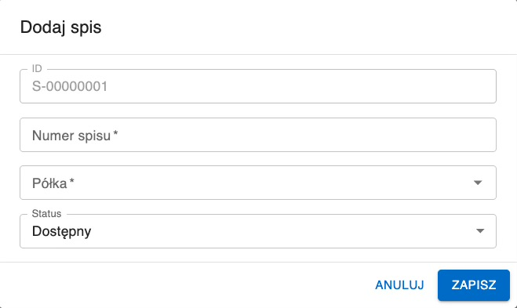

#  Spisy

Moduł Spisy przedstawia oraz umożliwia edycję zbioru spisów wprowadzonych do systemu.

## Przeszukiwanie listy spisów

Pasek wyszukiwania daje możliwość filtrowania listy spisów. W wyszukiwarce można wpisać dowolny ze szczegółów spisu, np. jego numer lub półkę.

Listę można sortować według wielu kryteriów. Aby to zrobić należy kliknąć w Sortowanie na pasku wyszukiwania (domyślne sortowanie: ID malejąco).

Pole Stan pozwala wybrać spisy z jakim statusem mają być wyświtlane. Opcjami do wyboru są:

- Dostępne - wszystkie spisy znajdujące się w archiwum (domyślne)
- Zniszczone - wszystie spisy, które zostały zniszczone
- Wszystkie - zarówno dostępne jak i zniszczone spisy

Każdy spis w tabeli posiada odnośnik do listy teczek przypisanych do tego spisu ("Teczki (x)" - gdzie x to liczba teczek w spisie).

Aby podjąć operację z elementem listy należy go wybrać. Aby to zrobić należy kliknąć w niego na liście.

Aby usunąć zaznaczenie z elementu listy należy wybrać z paska narzędzi przycisk Odznacz. Taki sam efekt daje kliknięcie w puste miejsce poza tabelą.

Przeglądanie następnych stron listy umożliwiają strzałki pod tabelą.

## Dodawanie spisu

Wybranie przycisku Dodaj z paska narzędzi spowoduje otwarcie okna dodawania nowego spisu. Okno to zawiera pola:

- **ID** - liczba porządkowa spisu automatycznie generowana przez system
- **Numer spisu** - numer spisu
- **Półka** - półka, na której znajduje się spis
- **Status** - Dostępny/Zniszczony, domyślnie Dostępne

**Uwaga:** aby móc zapisać dodawany spis, należy przypisać go do półki. Półka musi zostać najpierw utworzona (aby dowiedzieć się jak utworzyć półkę zajrzyj do działu [Półki](shelves.html)). Jeśli spis nie znajduje się jeszcze na żadnej półce w archiwum, można utworzyć półkę o nazwie "Tymczasowa".

Wszystkie teczki przypisywane do danego spisu będą automatycznie przejmowały jego półkę.

## Niszczenie a usuwanie spisu

Jeśli spis jest fizycznie niszczony należy wybrać spis z listy a następnie wybrać z paska narzędzi przycisk Zniszcz, zmienia to jego status na _Zniszczone_. Spis taki znika z domyślnego widoku listy spisów (aby go wyświetlić należy zmienić sortowanie listy - więcej o tym w dziale [Przeszukiwanie listy spisów](#przeszukiwanie-listy-spisow)).

Przycisku Usuń należy używać tylko i wyłącznie wtedy, gdy wybrana pozycja nie powinna nigdy się znajdować w systemie.

Użycie funkcji Usuń powoduje permamentne usunięcie elementu, podczas gdy Zniszcz zachowuje go w systemie, jedynie zmieniając jego status na _Znieszczone_.

**Uwaga:** nie można zniszczyć lub usunąć spisu jeśli są do niego przypisane jakieś niezniszczone teczki.

## Edycja szczegółów spisu

Po wybraniu spisu do edycji należy wybrać z paska narzędzi Edytuj. Spowoduje to otworzenie formularza identycznego do formularza dodawania.
