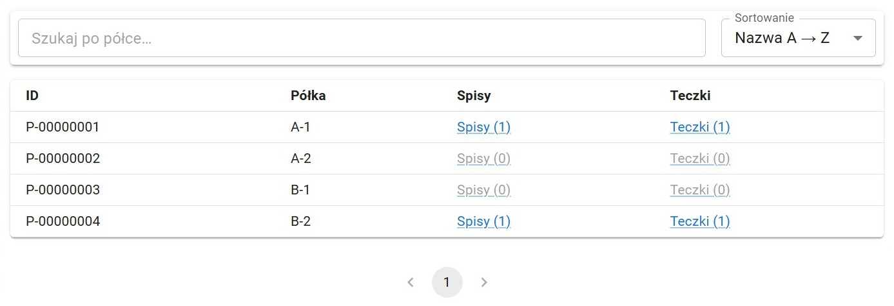
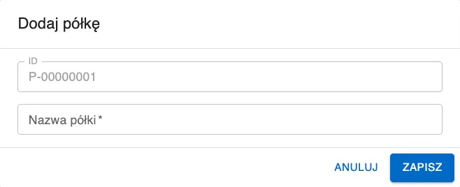

#  Półki

Moduł Półki przedstawia oraz umożliwia edycję zbioru półek wprowadzonych do systemu.

## Przeszukiwanie listy półek

Pasek wyszukiwania daje możliwość filtrowania listy półek. W wyszukiwarce można wpisać nazwę lub ID półki.

Listę można sortować według nazwy lub ID. Aby to zrobić należy kliknąć w Sortowanie na pasku wyszukiwania (domyślne sortowanie: nazwa alfabetycznie).

Każda półka w tabeli posiada odnośnik do listy teczek/spisów znajdujących się na tej półce ("Spisy (x)"/"Teczki (y)" - gdzie x/y to liczba spisów/teczek na półce).

Aby podjąć operację z elementem listy należy go wybrać. Aby to zrobić należy kliknąć w niego na liście.

Aby usunąć zaznaczenie z elementu listy należy wybrać z paska narzędzi przycisk Odznacz. Taki sam efekt daje kliknięcie w puste miejsce poza tabelą.

Przeglądanie następnych stron listy umożliwiają strzałki pod tabelą.

## Dodawanie półki

Wybranie przycisku Dodaj z paska narzędzi spowoduje otwarcie okna dodawania nowej półki. Okno to zawiera pola:

- **ID** - liczba porządkowa półki automatycznie generowana przez system
- **Nazwa półki**

Aplikacja Archivio nie narzuca żadnego systemu nazwewnictwa półek. Przykładowe nazwy:

- 1, 2, 3, 4, 5...
- A, B, C, D, E...
- A-1, A-2, B-1, B-2...

## Usuwanie półki

Aby usunąć półkę z systemu należy wybrać ją z listy a następnie wybrać z paska narzędzi przycisk Usuń. Spowoduje to permamentne usunięcie półki z systemu.

**Uwaga:** półkę można usunąć tylko i wyłącznie wtedy, gdy nie znajdują się na niej żadne teczki ani spisy.

## Zmiana nazwy półki

Po wybraniu półki do edycji należy wybrać z paska narzędzi Edytuj. Spowoduje to otworzenie formularza identycznego do formularza dodawania.
